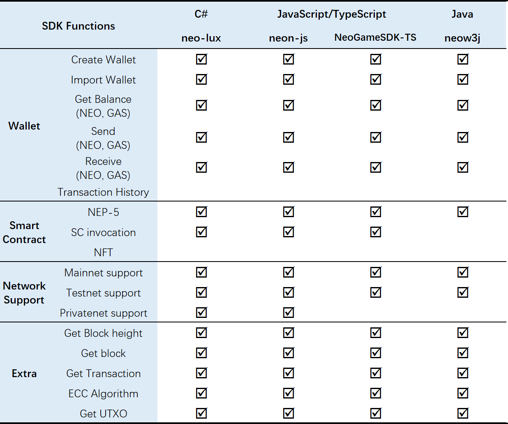
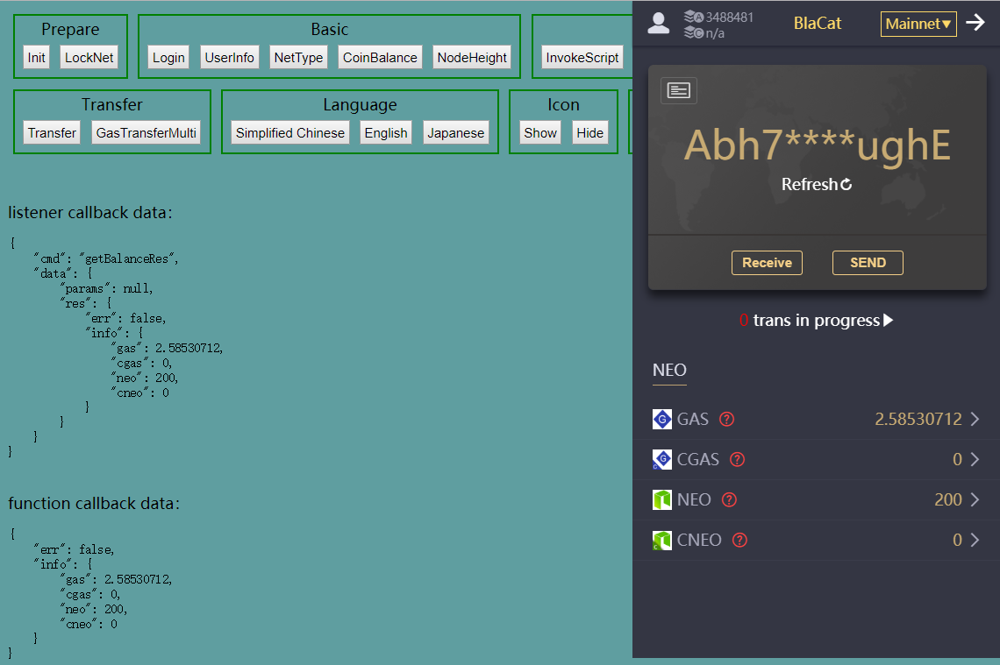

# NEO-SDK
NEO SDK allows developers to quickly build blockchain games or DApps to interact with NEO blockchain, such as creating wallets, sending assets or invoking smart contracts, etc. Developers can also use NEO SDK to develop various NEO-related applications, for example, NEO wallet, Blockchain Explorer, etc.

Considering different development requirements, NEO currently provides various SDKs written in different programming languages, including:
* C#
* Java
* JavaScript/Typescript

Features supported by different NEO-SDK

&emsp;&emsp;

## C# NEO-SDK
### 1. [neo-lux](https://github.com/CityOfZion/neo-lux)
NEO Lux was developed by CoZ, one of the NEO developer communities, to provide an easy way to interact with NEO blockchain using C#.

To learn how to use neo-lux, please refer to  [NEO Lux GitHub page](https://github.com/CityOfZion/neo-lux#neo-lux);
## JavaScript/Typescript NEO-SDK
### 1. [Neon-js](https://github.com/CityOfZion/neon-js)
Neon-js is a JavaScript library to interface with NEO blockchain, providing quick and easy methods to send RPC calls, create transactions and simple contract invocations.

Features
* Built-in RPC queries
* Transaction creation, serialization and deserialization
* Wallet key manipulation
* Smart Contract script builder
* 3rd party API support

For installation and usage, please visit [neon-js docs](http://cityofzion.io/neon-js/docs/en/overview.html). 

For API info, please visit [neon-js API](http://cityofzion.io/neon-js/docs/en/api/index.html).

Neon-js is open source on [GitHub](https://github.com/CityOfZion/neon-js).
### 2. [BlaCatSDK](https://github.com/FunJumping/NeoGameSDK_TS_mini)
This is another NEO SDK written in JavaScript/TypeScript, which is provided by BlaCat. 

To play around with a simple demo and learn how to use this NEO SDK:
1. Clone the project, or download directly from [here](https://github.com/FunJumping/NeoGameSDK_TS_mini/archive/master.zip).
    ```
    git clone https://github.com/FunJumping/NeoGameSDK_TS_mini.git
    ```

2. Open the `\NeoGameSDK_TS\index.html` in browser.
    \
    \
    

3. Then you can create or import a NEO wallet to start testing all other functions.

Please read [BlaCat documentations](https://github.com/FunJumping/NeoGameSDK_TS_mini#blacatsdk-usage-documentation) for other usages in detail.

## Java NEO-SDK
### 1. [neow3j](https://github.com/neow3j/neow3j#neow3j-a-java-library-to-interact-with-neo-nodes)
We also have NEO SDK for java developers - neow3j which aims to provide an easy and reliable integration to NEO blockchain. 

neow3j is an open-source project developed by the community and maintained by AxLabs, you can access the source code [here](https://github.com/neow3j/neow3j). 

neow3j provides docs for the followings:
* [How to use neow3j](https://github.com/neow3j/neow3j#getting-started)
* [Features](https://github.com/neow3j/neow3j#features) 
* [Examples](https://github.com/neow3j/neow3j#examples) and  [Examples source code](https://github.com/neow3j/neow3j-examples)

