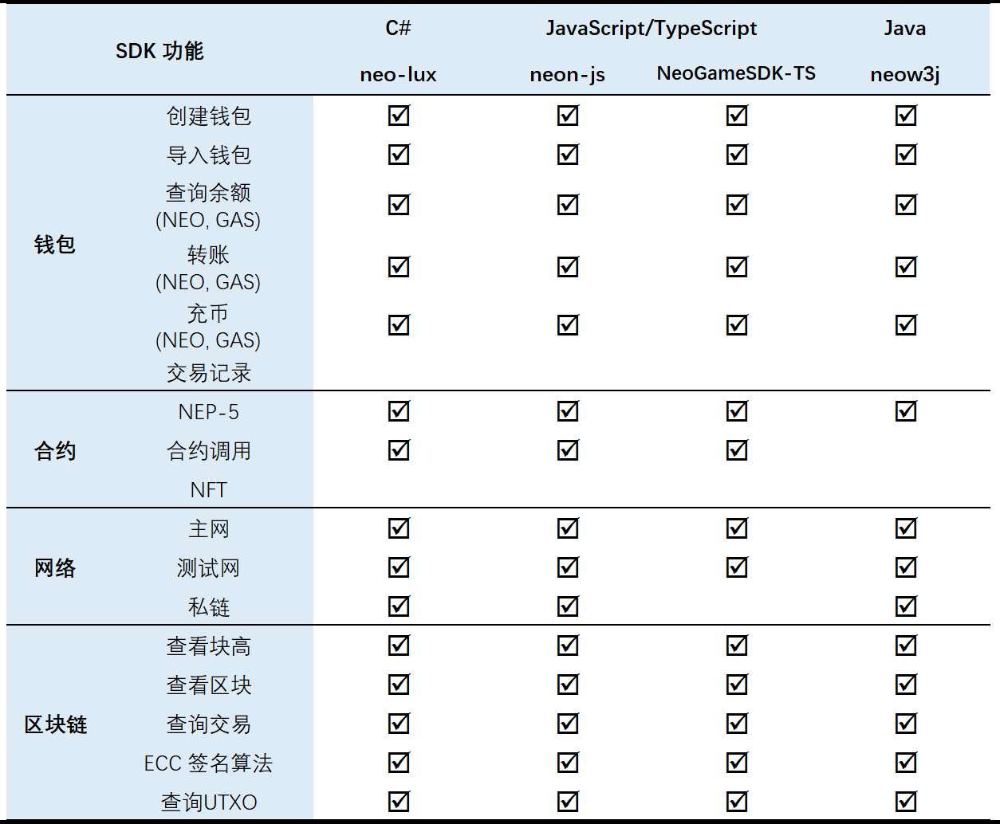

# NEO-SDK
为了方便开发者快速的开发和NEO交互的区块链游戏或者dApps，NEO-SDK为开发者包装了其所需的所有功能，例如：创建以及使用钱包、交易数字资产以及调用智能合约等功能。NEO-SDK为开发者提供了相对灵活的方式，便于开发者在区块链游戏中集成并且维护自己的钱包功能、调用智能合约、以及处理游戏或者aApps产生的交易。

针对不同开发者的需求，NEO提供了以下语言的NEO-SDK：
* C#
* JavaScript
* Java

不同版本NEO-SDK的功能：

&emsp;&emsp;

## C# NEO-SDK
### 1. [neo-lux](https://github.com/CityOfZion/neo-lux)
NEO Lux是C#版本的NEO-SDK，由NEO开发者社区CoZ提供。

请参考[NEO Lux GitHub page](https://github.com/CityOfZion/neo-lux#neo-lux)学习如何使用neo-lux。

## Java NEO-SDK
### 1. [neow3j](https://github.com/neow3j/neow3j#neow3j-a-java-library-to-interact-with-neo-nodes)
neow3j 是Java版本的NEO-SDK，由NEO社区开发并由AxLabs维护，代码已经在[GitHub开源](https://github.com/neow3j/neow3j)。

neow3j提供以下文档支持：
* [如何使用neow3j](https://github.com/neow3j/neow3j#getting-started)
* [功能](https://github.com/neow3j/neow3j#features) 
* [例子](https://github.com/neow3j/neow3j#examples) 以及  [相应的代码](https://github.com/neow3j/neow3j-examples)

## JavaScript/Typescript NEO-SDK
### 1. [Neon-js](https://github.com/CityOfZion/neon-js)
Neon-js是JavaScript版本的neo-sdk, 通过封装复杂的调用过程，为开发者提供简易的接口用于发送RPC请求，构造并发送交易、以及智能合约的调用等。

功能包括：
* 支持NEO所有RPC请求
* 构造交易、序列化和反序列化
* 钱包私钥操作
* 智能合约脚本生成
* 第三方API支持

参考文档：
* 安装和使用说明, 请参考 [neon-js docs](http://cityofzion.io/neon-js/docs/en/overview.html). 

* API使用介绍, 请参考 [neon-js API](http://cityofzion.io/neon-js/docs/en/api/index.html).

* 功能示例, 请参考 [neon-js examples](http://cityofzion.io/neon-js/docs/en/examples/index.html).

Neon-js 已开源于 [GitHub](https://github.com/CityOfZion/neon-js).

### 2. [BlaCatSDK](https://github.com/FunJumping/NeoGameSDK_TS_mini)
由BlaCat提供的另一个JavaScript/TypeScript版本的NEO-SDK。

BlaCatSDK提供了一个简单的demo, 便于开发者学习使用NEO-SDK：
1. Clone项目, 或者直接在 [这里下载](https://github.com/FunJumping/NeoGameSDK_TS_mini/archive/master.zip)。
    ```
    git clone https://github.com/FunJumping/NeoGameSDK_TS_mini.git
    ```

2. 用浏览器打开 `./NeoGameSDK_TS/index.html`。
    \
    \
    

3. 可以通过界面创建或者导入NEO钱包，并测试其他功能。

详细使用说明，请阅读 [BlaCat 文档](https://github.com/FunJumping/NeoGameSDK_TS_mini#blacatsdk-usage-documentation)。

