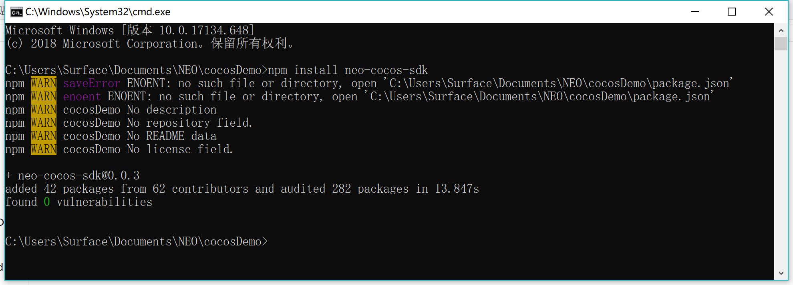
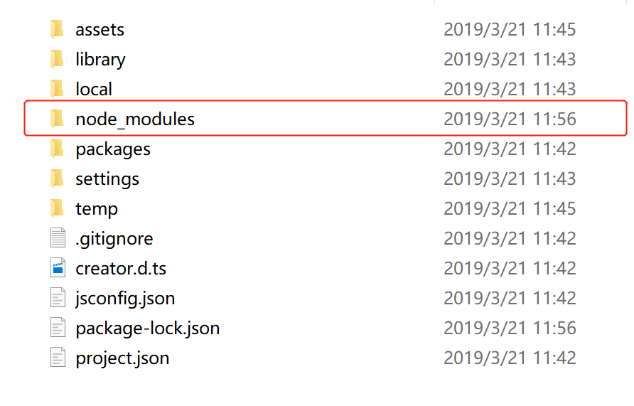
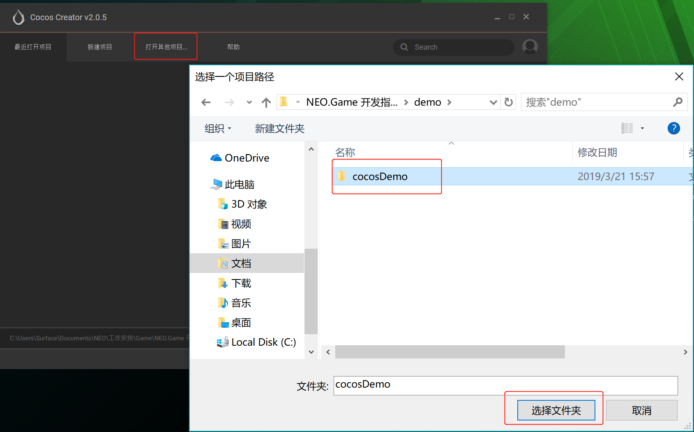
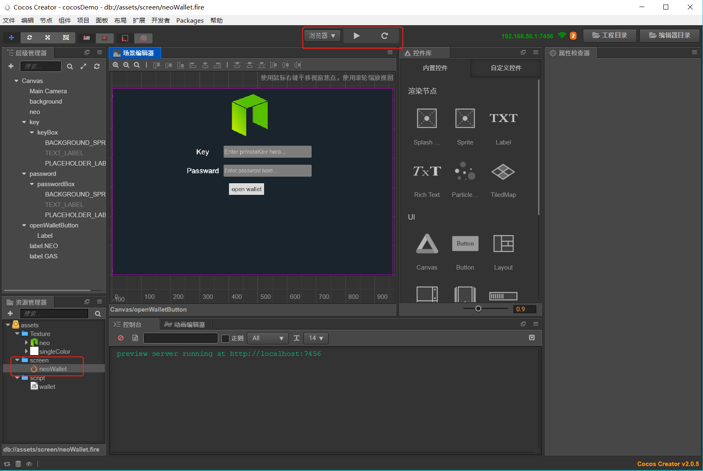
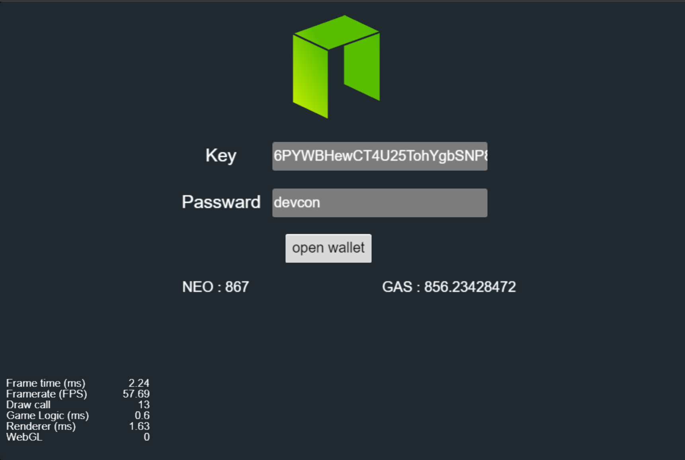

# Cocos Creator 支持 (JavaScript)
neo-cocos-sdk 是基于[neon-js](http://cityofzion.io/neon-js/en/), 专门为Cocos Creator开发的JavaScript NEO-SDK。neo-cocos-sdk可以很简单的在Cocos Creator创建的项目中集成，为开发者提供简易的接口用于发送RPC请求，构造并发送交易、以及智能合约的调用等。

## 1. 依赖
* NodeJs/npm
* [Cocos Creator](https://cocos2d-x.org/download)
* neo-cocos-sdk
## 2. 在Cocos Creator中集成neo-cocos-sdk
安装完NodeJs 和 Cocos Creator以后，开发者就可以使用Cocos Creator创建NEO区块链游戏。

我们通过基础的钱包功能来演示如何在Cocos Creator使用neo-cocos-sdk ，希望开发者在这之后能自行探索诸如创建交易，开发以及调用智能合约等更多功能。

 1. 下载并安装 [Cocos Creator](https://cocos2d-x.org/download)
 2. 用以下命令clone项目或者直接从 [下载](https://github.com/neo-ngd/NEO.Game-Developer-Guide)
     ```
    git clone https://github.com/neo-ngd/NEO.Game-Developer-Guide.git
    ```
 3. 在cocosDemo中集成neo-cocos-sdk
 \
 开发者需要运行下面的命令安装 neo-cocos-sdk 包，确保在`cocosDemo`的主目录下安装neo-cocos-sdk包。

     ```JavaScript
     npm install neo-cocos-sdk
     ```

    neo-cocos-sdk安装完毕后，相应的node-modules将会下载到`cocosDemo`的主目录下。

     
     
 4. 在 Cocos Creator打开演示项目
    \
    \
     
 
 5. 使用 neo-cocos-sdk 接入 NEO 测试网
 
    以下所有代码都在 `/demo/cocosDemo/assets/script/wallet.js`文件中。
    
    从 `neo-cocos-sdk`导入所需包：
    ```
    const { default: Neon, api, wallet, tx, rpc, CONST, nep5, u } = require("neo-cocos-sdk");
    ```

    通过测试网节点，接入NEO测试网：
    ```
    var network = "http://seed2.neo.org:20332";
    var rpcClient = new rpc.RPCClient(network);
    ```

    打开钱包 & 查询NEO和GAS余额：
    ```
    var account = new wallet.Account(encrytedKey);
    account.decrypt(password)
    .then(decrptedAcc => {
        var address = decrptedAcc.address;
        rpcClient.getAccountState(address).then......
    }
    ```
 6. 现在可以打开neoWallet screen，点击运行按钮，即可用浏览器模式查看结果 
    \
    \
     
    
    需要使用加密的私钥和密码打开钱包，然后就可以看到该钱包在测试网的NEO和GAS余额。
    \
    \
     

完成上述步骤，开发者应当已经掌握： 
* 如何在Cocos Creator中集成neo-cocos-sdk
* 如何在Cocos Creator创建的游戏中接入NEO测试网
* 如何使用neo-cocos-sdk和NEO测试网交互

之后，开发者可以参考[NEO smart contract](../4.智能合约开发.md)，学习如何开发、部署智能合约，然后在Cocos Creator创建的游戏项目中通过neo-cocos-sdk调用智能合约。

更多关于neo-cocos-sdk的功能与用法，请参考[neon-js docs](http://cityofzion.io/neon-js/docs/en/api/index.html)。

## 3. Sample
*待续* 
