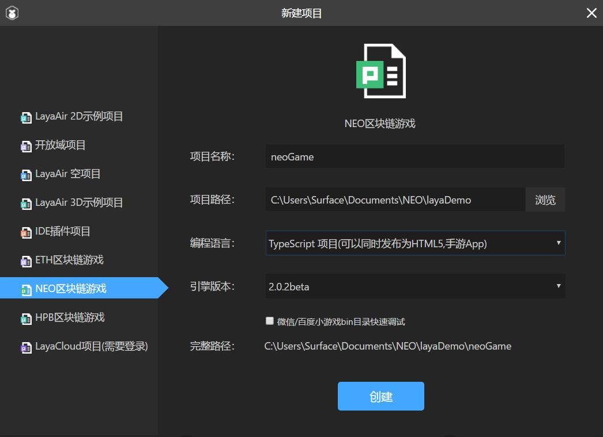
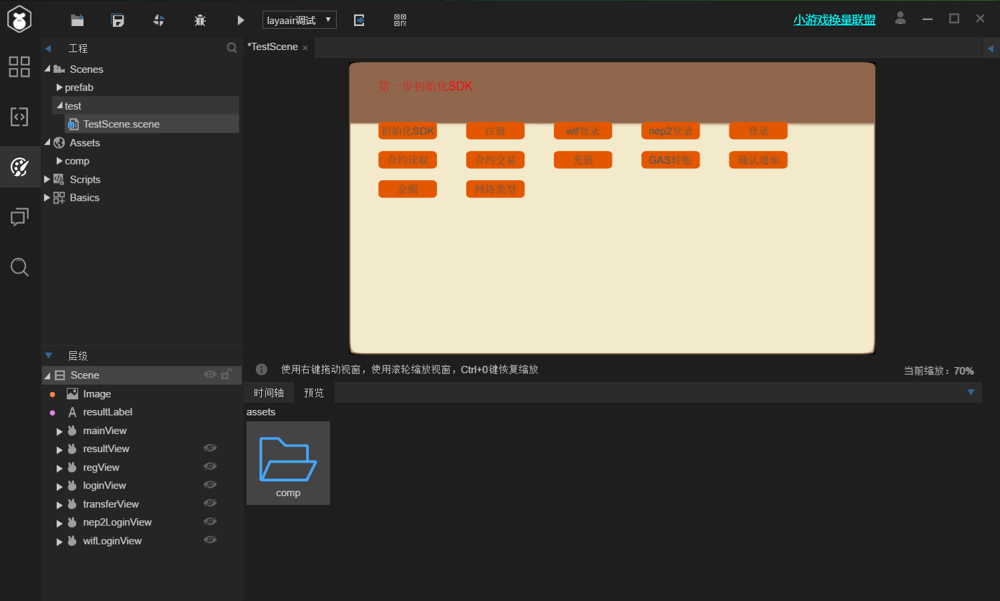
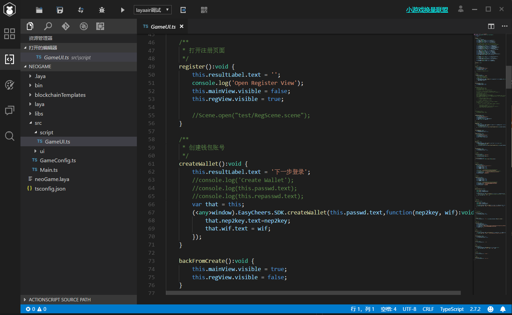

# Laya.Air 支持 (JavaScript)
LayaAir是Layabox旗下第二代HTML5开源引擎, 其突破性的将HTML5游戏，2D、3D、AR、VR和页游、Native手游等诸多需求在一个引擎集成，开发者可以通过游戏引擎同时发布HTML5游戏，微信小游戏，手游和区块链游戏。

LayaAir 2.0.2 beta版本已经高度集成了对NEO区块链游戏开发的支持，主要包括钱包的创建以及调用，NEP-5支持，以及智能合约接口的调用，开发者可以在LayaAir里直接创建NEO区块链游戏。

## 1. 预安装
* [LayaAir 2.0.2beta](https://ldc2.layabox.com/layadownload/?type=layaairide-LayaAir%20IDE%202.0.2beta)

## 2. 使用LayaAir开发游戏
下载安装LayaAir后，开发者可以直接创建NEO区块链游戏，不需要再额外的集成NEO-SDK。
1. 下载安装LayaAir 2.0.2beta

2. 打开layaAir -> 新建项目 -> 选择NEO区块链游戏
\
LayaAir会自动创建一个游戏模板，把NEO-SDK集成到该游戏中，开发者可以调用NEO-SDK提供的接口。

    

3. LayaAir会自动创建一个测试页面，实现了基本的钱包功能以及合约调用的功能，供开发者参考、然后尝试更多的NEO-SDK接口。

    

4. 该测试页面接入到NEO测试网，开发者可以在LayaAir中参考`/src/script/GameUI.ts`，学习如何使用LayaAir集成的NEO-SDK实现区块链游戏和NEO的交互。

    

## 3. neo-SDK 功能详解

1. **初始化neo-SDK**
    
    在调用SDK前一定要初始化。
    ```
    EasyCheers.SDK.init();
    ```
2. **创建钱包**

    创建钱包时，需要输入密码，然后LayaAir集成的NEO-SDK会通过NEP-2标准对私钥进行加密。
    
    钱包生成以后，会返回 WIF 以及 NEP-2加密的key。 

    *参数*：
    * `password`: 用于对私钥加密的密码

    ```
    EasyCheers.SDK.createWallet(password, function(nep2key, wif):void {
            that.nep2key.text=nep2key;
            that.wif.text = wif;
    });
    ```

3. **导入/登录钱包**

    开发者可以通过三种方式打开NEO钱包。

    * 通过WIF打开钱包，不需要密码

        *参数*：
        * `wif`: 生成钱包时，生成的WIF
    ```
    EasyCheers.SDK.loginWif(wif, function(res):void {
            that.wifLoginState.text = res;
    })
    ```
    * 通过加密以后的NEP-2 key + 密码打开钱包

        *参数*：
        * `nep2Key`: 生成钱包时，对应生成的NEP-2 key
        * `password`：生成钱包时，输入的密码
    ```
    EasyCheers.SDK.loginNep2(nep2Key, password, function(res):void {
            that.nep2LoginState.text = res;
    })
    ```
    * 通过钱包文件打开钱包

        *参数*：
        * `password`：生成钱包时，输入的密码
        * `walletJson`：钱包文件的Json字符串
    ```
    EasyCheers.SDK.login(password, walletJson) {
    })
    ```
4. **查询余额**

    当钱包打开以后，可以查看该钱包的 NEO & GAS 的余额。

    ```
    EasyCheers.SDK.getBalances(function(neo, gas):void {
            that.resultLabel.text = "neo:" + neo + " gas:" + gas;
    })
    ```
5. **转账NEO或GAS**

    NEO和GAS作为NEO公链上流通的币，LayaAir集成的neo-SDK也提供了比较简易的方式进行转账。

    *参数*：
    * `assetID`: NEO和GAS的ID，分别为：
        * NEO：*c56f33fc6ecfcd0c225c4ab356fee59390af8560be0e930faebe74a6daff7c9b*
        * GAS：*602c79718b16e442de58778e148d0b1084e3b2dffd5de6b7b16cee7969282de7*
    * `toAddress`: NEO和GAS接收人的钱包地址
    * `amount`: 转账数额(NEO最小单位为1， GAS最小单位是小数点后8为)

    ```
    EasyCheers.SDK.transferGlobalAsset(assetID, toAddress, amount, function(res):void {
            console.log("trade", '[Easy]', 'transferGlobalAsset.callback.function.res => ', res)
    })
    ```
6. **转账NEP-5 token**
    
    NEP-5资产是NEO区块链上发行的数字资产，所有在NEO发行的NEP-5资产都需要遵循NEP-5标准，详细的信息可以参考[NEP-5 token standard](https://github.com/neo-project/proposals/blob/master/nep-5.mediawiki)。

    LayaAir集成的NEO-SDK也提供了简单的接口，直接转账NEP-5资产。

    *参数*：
    * `contractHash`: 部署NEP-5合约上链以后，对应该合约生成的SciptHash
    * `toAddress`: NEO和GAS接收人的钱包地址
    * `amount`: 转账数额
    ```
    window.EasyCheers.SDK.transferNep5(contractHash, toAddress, amount, function(res):void {
		console.log("read", '[Easy]', 'invokescript.callback.function.res => ', res);
	});
    ```

7. **合约调用-测试**

    当开发者在NEO公链上部署了智能合约（NEP-5， NEP以及任何合约）以后，可以在LayaAir制作的NEO区块链游戏中通过SDK调用智能合约。关于如何编写、编译以及部署合约，请参考上一章[智能合约开发](../4.智能合约开发.md)。

    这里的调用只适用于测试，并不会生成交易然后上链。

    *参数*：
    * `contractHash`: 部署合约上链以后，对应合约生成的SciptHash。
    * `method`: 需要调用合约的方法，例如：balanceOf, symbol, transfer, etc
    * `params`: 调用合约需要传递的参数以数组的形式传入，针对不同合约方法，传递的参数不同。
    ```
    window.EasyCheers.tools.Contract.contractInvokeScrip(contractHash, method, params, function(res):void {
		console.log("read", '[Easy]', 'invokescript.callback.function.res => ', res["stack"]);
	});
    ```
8. **合约调用**

    通过智能合约Hash, 方法以及参数直接调用已经部署的智能合约，并且生成交易、广播交易、然后最终上链。

    *参数*：
    * `contractHash`: 部署合约上链以后，对应合约生成的SciptHash。
    * `method`: 需要调用合约的方法，例如：balanceOf, symbol, transfer, etc
    * `params`: 调用合约需要传递的参数以数组的形式传入，针对不同合约方法，传递的参数不同。
    ```
    var script = window.EasyCheers.tools.Contract.buildScript(contractHash, method, params);
    var res = await window.EasyCheers.tools.Contract.contractInvokeTrans_attributes(script);
    console.log("result is " + res);
    ```

## 4. Sample
NEO社区通过LayaAir创建了一个简单的游戏，可以参考[这里](http://easycheers.com/quickLearning.docx)。

该游戏的代码也提交至[GitHub](https://github.com/easycheers/Guess)供开发者参考。

