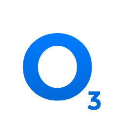

# NEO Wallet Browser Extension
NEO wallet browser extension provides an easy way for browser games or dApps to interact with NEO blockchain without running a NEO full node. It plays the role as a NEO wallet as well as an accessing point to the NEO blockchain to invoke smart contracts. Therefore, developers can focus more on building blockchain games and smart contracts.

Currently, there are several NEO wallet broswer extensions provided by NEO communities. They support APIs or functions that a blockchain game or dApp may requires. 

We have collected useful guidance and instructions for the following NEO wallet browser extensions:

## 1. [NEOLine](https://neoline.cn/)
&emsp;&emsp;&emsp;
* Install the latest version from [chrome web store](https://chrome.google.com/webstore/detail/neoline/cphhlgmgameodnhkjdmkpanlelnlohao)
* Or download latest installation pakcage [here](https://github.com/NeoNextClub/neoline/releases) and following the [installation instruction](https://neoline.cn/tutorial/).
* For developers to learn how to develop games or dApps, please refer to [NEOLine API reference](https://neoline.cn/dapi/)

## 2. Teemo
&emsp;&emsp;
* For download and installation, please visit [Teemo's website](https://teemo.nel.group/index.html)
* For game and dApp developers, please visit [NEO dApi documents](https://dapi.nel.group/en/#neo-dapi-introduction) to learn how to use Teemo with your projects

## 3. O3
&emsp;&emsp;

O3 is different from the other two browser extensions. It is not a browser extension, but a standalone desktop application which could be used with games or dApps to interact with NEO blockchain.
* Please download O3 [here](https://o3.network/).
* For how to setup and use O3 with browser-based games or dApps, please visit [O3 Documentation](https://docs.o3.network/neoDapi/)
