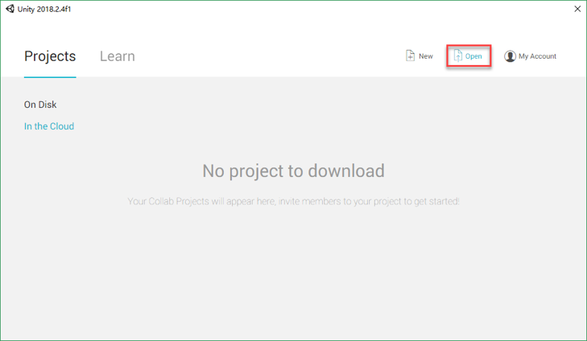
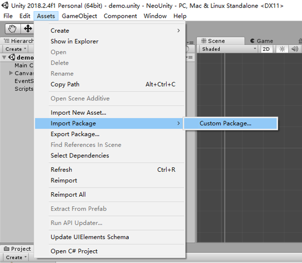
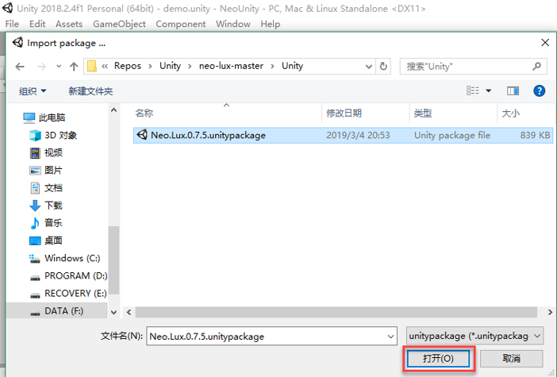
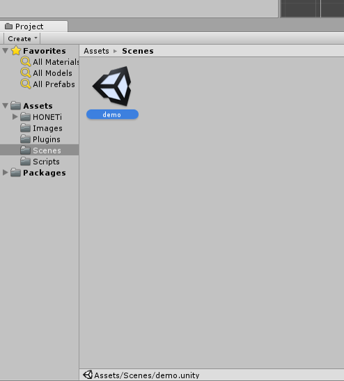
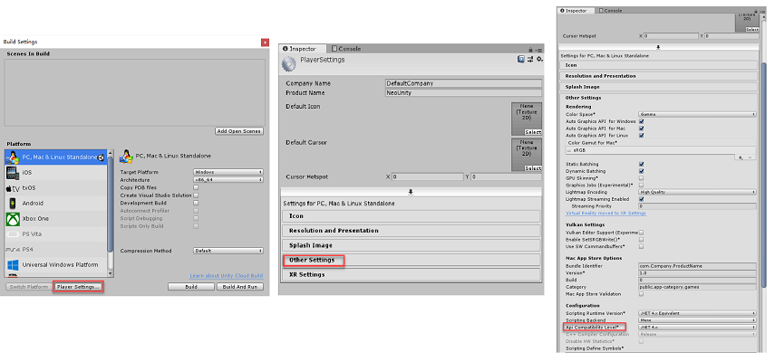

# Unity support (.NET)
[NEOLux](https://github.com/CityOfZion/neo-lux) is a .NET NEO-SDK, which can be integrated into Unity to build blockchain games that interact with NEO blockchain and invoke smart contracts. 
## 1. Prerequisites
* [Unity](https://unity.com/)
* [neo-lux unitypackage](https://github.com/CityOfZion/neo-lux/blob/master/Unity/Neo.Lux.0.7.5.unitypackage)
* .Net 4.6
## 2. Using neo-lux with Unity
**Note**: 
* Use caution, as most NEOLux methods are blocking calls; in Unity the proper way to call them is using [Coroutines](https://docs.unity3d.com/Manual/Coroutines.html).

We provide a simple [Unity demo](https://github.com/CityOfZion/neo-lux/tree/master/Demos/NeoUnity) showcasing loading a NEO wallet and querying the balance from NEO TestNet. Developers can follow the instructions to learn how to integrate NEOLux into Unity and then explore more functions to interact with NEO blockchain.
1. Download and install [Unity](https://store.unity.com/)
2. Download [neo-lux](https://github.com/CityOfZion/neo-lux) from GitHub
2. Clone the project, or download directly from [here](https://github.com/CityOfZion/neo-lux/archive/master.zip)
    ```
    git clone https://github.com/CityOfZion/neo-lux.git
    ```
3. Open the folder where you have saved the demo (`./neo-lux-master/Demos/NeoUnity`)
    \
    \
     

4. Import [neo-lux unity package](https://github.com/CityOfZion/neo-lux/raw/master/Unity/Neo.Lux.0.7.5.unitypackage)(`./neo-lux-master/Unity`) into your project
    \
    \
     
    \
    \
     
5. Open demo scenes (double click)
    \
    \
     
6. Click play button to see the demo results
    \
     **NOTE**: if you are still receiving errors in the console window, you should go to top bar -> File -> Build Settings -> Player Settings -> Other Settings, and then set the API compatibility level to `.NET 4.x `.
    \
     

The code, which communicates with NEO blockchain, is written in NeoDemo.cs (`./neo-lux-master/Demos/NeoUnity/Assets/Scripts/NeoDemo.cs`)

Now you have used Unity to create a simple demo which interacts with NEO TestNet, it is time to write more codes to try other functions NEOLux provides. 

For more functions and usages of NEO-Lux, please refence to [NEOLux Usage](https://github.com/CityOfZion/neo-lux#usage) and [demos](https://github.com/CityOfZion/neo-lux/tree/master/Demos).

## 3. Sample
There is a also a good tutorial demonstrating how to make a game using NEO + Unity on Medium which was provided by one of NEO community developers. Please [click here](https://medium.com/@tbriley/making-a-game-with-neo-unity-part-1-4099ec7d7a82) to learn more.
