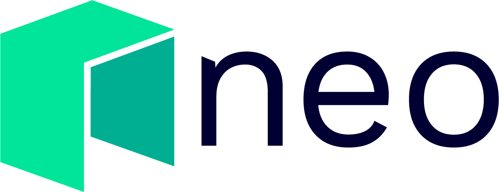

  

# NEO.Game Developer Guide
Welcome to the NEO.Game Developer Guide, one of NEO technical documentations to help developers to speed up the development of blockchain games or dApps on NEO. This guide includes all the useful resources that NEO provides, it covers all the tools and corresponding instructions that developers will need to build NEO games or dApps. The whole purpose is to make it as easy as possible to build, test and deploy games or dApps on NEO.

This guide provides the following support for blockchain game or dApp developers:
1. How to set up NEO blockchain?
2. How to use NEO-SDK?
3. How to use NEO wallet browser extension?
4. How to write NEO smart contract?
5. How to develop a blockchain game using gaming engine, NEO-SDK or wallet extension?

In addition, NEO provides official technical documentation, explaining the following in detail (Please click on the following links to learn more): 
* [DBFT Consensus](https://docs.neo.org/en-us/basic/consensus/whitepaper.html)
* [NEO Node Introduction](https://docs.neo.org/en-us/node/introduction.html)
* [NEO API Reference](https://docs.neo.org/en-us/node/cli/latest-version/api.html), and more.

## Development Guide
This guide mainly focuses on NEO blockchain game development, but can aslo be applied to any dApp development. 
### **1. Setting up NEO blockchain**
The first step for development is to set up NEO blockchain, which is used for developing and testing of blockchain games or dApps. We offer two methods of doing this:
* Setting up NEO PrivateNet
* Using NEO TestNet

[Pleas click here](./1.Setting_Up_NEO_Blockchain.md) for how to set up NEO blockchain.
### **2. NEO SDK**
NEO SDK allows developers to quickly build your games or dApps to interact with NEO blockchain, such as creating wallets, sending assets or invoking smart contracts, etc. It offers a more flexible and diverse approach for developers to maintain your own NEO wallet as well as process transactions generated by games or dApps. 

Considering different development requirements, NEO currently provides various SDKs written in different programing languages, including:
* C#
* JavaScript
* Java

[Pleas click here](./2.NEO_SDK.md) for instructions and usage of all NEO SDKs.

### **3. Wallet Browser Extension**
Apart from handling NEO wallets and transactions via NEO SDK within games and dApps, developers can also integrate NEO wallet browser extensions into their browser-based games or dApps to interact with NEO blockchain. In this way, the responsibilities of maintaining NEO wallet and guaranteeing the privacy and safety of users' private keys will be taken care of by the wallet provider. Developers can focus more on building their blockchain games and smart contracts.

Currently, developers can use one of the following extensions:
* NEOLine
* Teemo
* O3

[Pleas click here](./3.Wallet_Browser_Extension.md) for NEO wallet browser extension guide.

### **4. Smart Contract Development**
For gaming projects requiring the creation of token assets, NFT or implementing game logics using smart contracts on-chain, we also provide full support on smart contract development and invocation, including:
* NEP-5 token standard
* NFT standard 
* Writing smart contract with C#, Python, and Java

[Pleas click here](./4.Smart_Contract_Development.md) to learn how to build your smart contracts with different programing languages.

### **5. Gaming Engine Support**
For game developers with a preferred gaming engine, we provide tools and instructions to enable developers to build NEO blockchain games with their preferred gaming engine.

This section covers the basic development instructions for some of the most popular gaming engines, including:
* Unity
* Cocos Creator

[Pleas click here](./5.Gaming_Engine_Support.md) for detailed instructions. 

We plan to support more engines soon.
