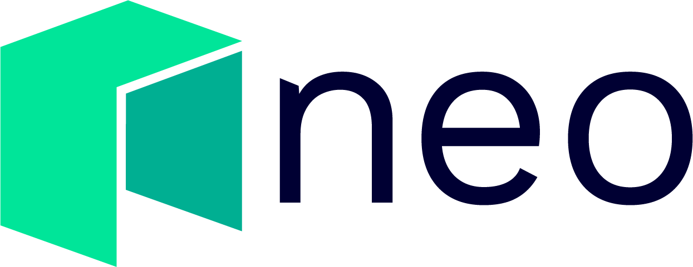

  

# NEO.Game Developer Guide
Welcome to NEO.Game Developer Guide, one of NEO technical documentations to help developers to speed up development of blockchain games or DApps on NEO. This guide includes all the useful resources that NEO have provided, it covers all the tools and corresponding instructions that developers will need to build NEO games or ADpps. The whole purpose is to make it as easy as possible to build, test, deploy games and DApps on NEO.

This guild provides the following supports for blockchain game or DApp developers:
1. How to set up NEO blockchain?
2. How to use NEO-SDK?
3. How to use NEO wallet extension?
4. How to write NEO smart contract?
5. How to develop a blockchain game using gaming engine, NEO-SDK or wallet extension?

In addition, NEO provides official technical documentation, which explains in detail for the following (Please feel free to read them): 
* [DBFT Consensus](https://docs.neo.org/en-us/basic/consensus/whitepaper.html)
* [NEO Node Introduction](https://docs.neo.org/en-us/node/introduction.html)
* [NEO API Reference](https://docs.neo.org/en-us/node/cli/latest-version/api.html), and more.

## Development Guide
This guide mainly focus on NEO blockchain games development, but also apply to any DApp development. 
### **1. Setting up NEO blockchain**
The first step for development is to set up NEO blockchain, which is used for developing and testing of blockchain games or DApps. We offer two methods of doing that:
* Setting up NEO PrivateNet
* Using NEO TestNet

[Pleas click here](./1.Setting_Up_NEO_Blockchain.md) for how to set up NEO blockchain.
### **2. NEO SDK**
NEO SDK allows developers to quickly build your games or DApps to interact with NEO blockchain. For example, creating wallet, sending asset or invoking smart contract, etc. Developers can focus on building games or DApps that use the functions provided by the NEO blockchain via NEO-SDK.

Considering different development requirements, NEO currently provides various SDKs written in different programing language, including:
* C#
* JavaScript
* Java

[Pleas click here](./2.NEO_SDK.md) for instructions and usages of all NEO SDKs.

### **3. Wallet Browser Extension**
Apart from handing assets and transactions via NEO SDK within games and DApps, developers can also integrate NEO wallet browser extensions into your projects to interact with NEO blockchain. 

[Pleas click here](./3.Wallet_Browser_Extension.md) for NEO wallet browser extension guide.

### **4. Smart Contract Development**
For gaming projects with the requirements to create token asset, NFT or implement their game logics using smart contracts on-chain, we also provide full supports on smart contract development and invocation, including:
* NEP-5 token standard
* NFT standard 
* Writing smart contract with C#, Python, and Java

[Pleas click here](./4.Smart_Contract_Development.md) to learn how to build your smart contracts with different programing languages.

### **5. Gaming Engine Support**
For game developers with preferred gaming engine, we provide tools and instructions to enable developers to build NEO blockchain games with their preferred gaming engine.

This section covers the basic development instructions for some of the most popular gaming engines, including:
* Unity
* Cocos Creator

[Pleas click here](./5.Gaming_Engine_Support.md) for detailed instructions. 

We plan to support more engines soon.